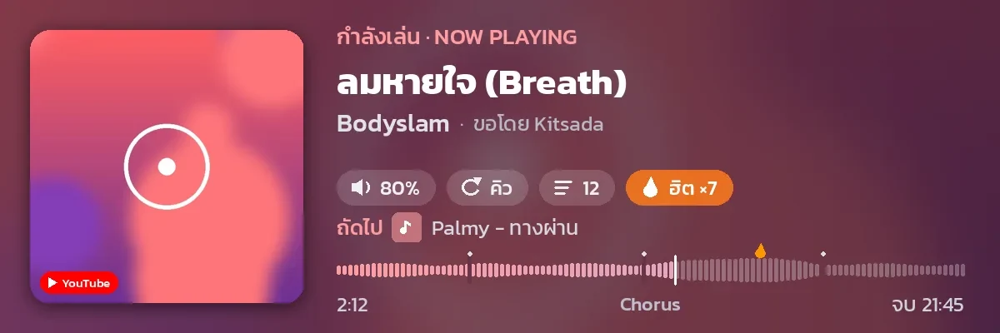
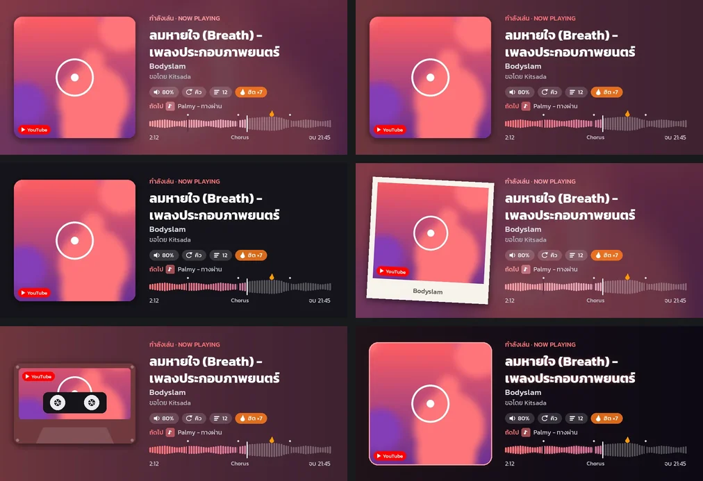
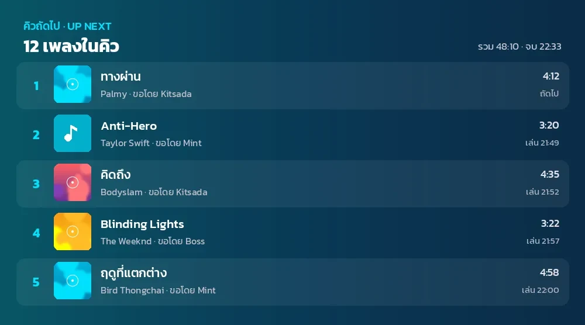
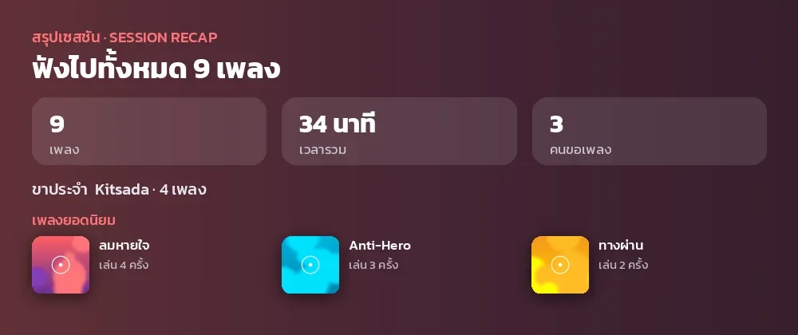
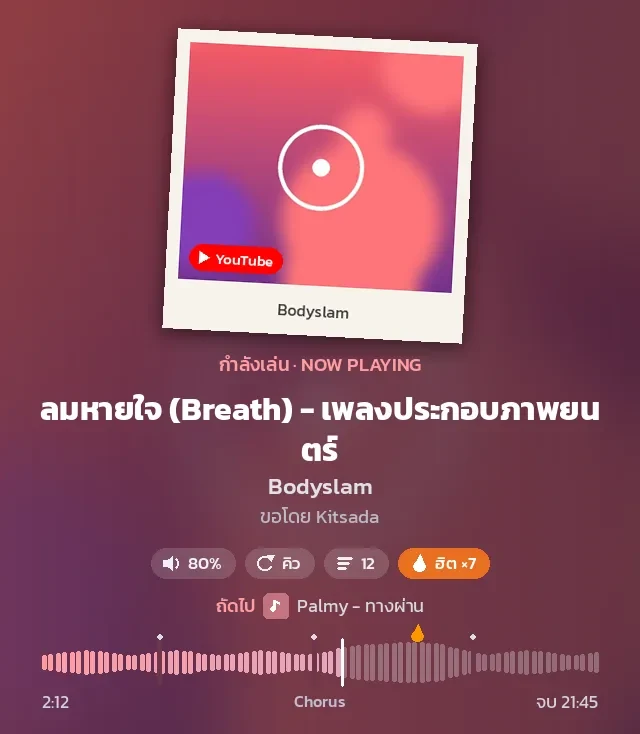
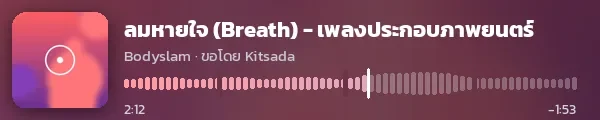

<div align="center">

# 🎵 P'Sak Music

**บอทเพลง Discord ภาษาไทย ที่เน้นความเสถียร หน้าตาสวย และใช้ง่ายสำหรับทุกคนในห้อง**


[ภาพตัวอย่าง](#screenshots) •
[ความสามารถ](#features) •
[ติดตั้ง](#install) •
[ตั้งค่า](#config) •
[คำสั่ง](#commands) •
[แก้ปัญหา](#troubleshooting)



</div>

---

<a id="screenshots"></a>

## 📸 ภาพตัวอย่าง

ภาพทั้งหมดเรนเดอร์จากโค้ดจริงของบอท (ฟอนต์ Kanit รองรับภาษาไทยเต็มรูปแบบ ตัวอักษรลาว เขมร พม่า จีน ญี่ปุ่น เกาหลีใช้ฟอนต์ Noto แทนให้อัตโนมัติ)

<table>
<tr>
<td colspan="2" align="center"><b>ธีมการ์ด 6 แบบ</b><br><sub>เบลอจากปก · สีพื้น · มินิมอล · โพลารอยด์ · เทปคาสเซ็ต · นีออน</sub><br></td>
</tr>
<tr>
<td align="center" width="50%"><b>การ์ดคิว</b><br></td>
<td align="center" width="50%"><b>การ์ดสรุปเซสชัน</b><br></td>
</tr>
<tr>
<td align="center"><b>รูปทรงจัตุรัส (มือถือ)</b><br></td>
<td align="center"><b>มินิการ์ด (โหมด compact)</b><br></td>
</tr>
</table>

---

<a id="features"></a>

## ✨ ความสามารถ

### 🎶 เล่นเพลง
- รองรับ **YouTube, Spotify** (track / album / playlist), **SoundCloud, Bandcamp**, ไฟล์เสียงแนบ (ในห้องขอเพลง) และคำค้นภาษาไทย
- **Gapless**: เตรียมเพลงถัดไปไว้ล่วงหน้า เพลงต่อกันทันทีไม่มีช่วงเงียบ
- **Crossfade**: ช่วง 4 วินาทีสุดท้ายเพลงเก่าค่อยๆ เบาลงพร้อมเพลงใหม่ค่อยๆ ดังขึ้น ฟังต่อเนื่องเหมือนวิทยุ
- **เปลี่ยนเพลงลื่น**: กด ⏭ ข้าม ⏮ ย้อน เล่นเพลงที่เลือก ก็ crossfade 1.5 วินาที (เพลงเดิมเบาลงใต้เพลงใหม่ ไม่มีช่วงเงียบ) กรอเพลงซ้อนกัน 0.4 วินาที และ ⏹ ค่อยๆ เบาลงก่อนหยุด
- **อ่านเสียงล่วงหน้า 1 วินาที**: เพลงเริ่มทันทีไม่ต้องรอ FFmpeg และเน็ตสะดุดสั้นๆ ไม่ทำให้เสียงขาด
- **Spotify จับคู่แม่น**: ค้น YouTube 5 ผลแล้วเลือกคลิปที่ความยาวและชื่อตรงที่สุด เลี่ยงเวอร์ชัน live, cover และ remix
- **ปรับความดังให้เท่ากันทุกเพลง** (FFmpeg loudnorm), fade-in / fade-out และปรับเสียงแบบนุ่มนวล
- **เนื้อเพลง** จาก lrclib.net ทั้งแบบเต็มและแบบ synced พร้อม **เนื้อเพลงสด (karaoke)** บน panel
- autocomplete ใน `/play`, `/search` แบบเลือกจากรายการ, กรอ, ย้อน, วนซ้ำ และ undo คิว 5 ครั้งล่าสุด

### 🖼️ การ์ด Now Playing
- แสดงชื่อเพลง ศิลปิน ป้ายแหล่งเพลง เพลงถัดไปพร้อมปกเล็ก และ chip สถานะที่ใช้ไอคอน
- **Waveform จากข้อมูลจริง**: ใช้ "ท่อนที่คนเล่นซ้ำมากสุด" ของ YouTube มีไอคอน 🔥 ตรงท่อนฮิต แท่งช่วงท่อนฮิตเป็นสีส้มให้เห็นล่วงหน้า และขีดแบ่ง chapter พร้อมชื่อ chapter ปัจจุบัน
- **6 ธีม × 3 รูปทรง** (แนวนอน · จัตุรัส · มินิ) สีดึงจากปกอัตโนมัติ และตรวจ contrast ให้อ่านง่าย
- การ์ดตอนกำลังโหลด, การ์ดตอนเล่นไม่ได้, การ์ดคิว, การ์ดสรุปเซสชัน และ `/card` สำหรับแชร์
- ป้าย **ฮิต ×N** สำหรับเพลงที่เปิดบ่อยในเซิร์ฟเวอร์ และป้าย **วันเกิดคนขอ** (`/birthday set`)
- **ภาษาอื่นไม่เป็นกล่อง □□□**: ตัวอักษรลาว เขมร พม่า มีฟอนต์มาในตัว ส่วนจีน ญี่ปุ่น เกาหลี บอทโหลดฟอนต์ครั้งเดียวตอนเจอเพลงแรก (ไฟล์ละ 4–9 MB เก็บใน `data/fonts`) อีโมจิในชื่อเพลงจะถูกตัดออกแทนการขึ้นเป็นกล่อง
- **ชื่อเพลงไม่ซ้ำ**: ชื่อแบบ "เพลง - ศิลปิน" ตัดชื่อศิลปินออกจากหัวเรื่อง (มีอยู่ในบรรทัดศิลปินแล้ว) และชื่อเดียวกันที่เขียนทั้งลาวและไทยเหลือแค่ภาษาไทย
- ชิปภาษาของเพลงพร้อมธงเล็กๆ (ไทย ลาว เกาหลี ญี่ปุ่น จีน เวียดนาม กัมพูชา พม่า) ดูจากตัวอักษรในชื่อเพลง
- ส่งเป็น WebP มี alt text สำหรับ screen reader และอัปโหลดใหม่เฉพาะเมื่อมีอะไรเปลี่ยน

### 🎛️ Panel และหน้าตา
- ทุกข้อความเป็น **กล่องเดียวแบบ Components V2** (สไตล์ Groove) หรือใช้ embed แบบเดิมได้ด้วย `UI_STYLE=classic`
- Panel: การ์ดสัดส่วน 3:1 แบบ Groove ตัวหนังสือใหญ่อ่านง่าย มีรูปโปรไฟล์คนขอเพลง ยอดวิวและปีที่ออก แถบ equalizer ขยับได้ ชื่อศิลปินที่ร่วมร้อง (ft./feat.) แยกไปไว้บรรทัดศิลปิน และสีขอบกล่องกับชิปตามสีปกเพลง ใต้การ์ดมีแค่ชื่อเพลงที่กดได้กับเวลานับถอยหลังที่เดินเองบนจอของแต่ละคน (ไม่ซ้ำกับในการ์ด) ตามด้วยปุ่มและบรรทัดสถานะ
- ชื่อเพลงสะอาด: ตัด "(Official Video)", "[MV]", "| Lyrics" ฯลฯ ออกตอนแสดงผล แต่เก็บ (Live), (Remix), (feat. …) ไว้
- ปุ่มบอกสถานะในตัว: 📜 แสดงจำนวนเพลงในคิว, ⏭ แสดงคะแนนโหวตข้าม (เช่น 2/3), ➕ สีเขียว, ⏹ สีแดง และปุ่มที่ใช้ไม่ได้ตอนนั้นเป็นสีเทา เช่น ⏩ ตอนใกล้จบเพลง
  ```
  ⏮  ⏪  ⏯  ⏩  ⏭
  ⏹  🔁  🔀  📜 12  🎤
  ➕ เพิ่มเพลง   🔇 ปิดเสียง   🔥   📻   🎙 เนื้อสด
  [ 🔈 ระดับเสียง: 25% · เบา ▾ ]
  -# ⏭ @Mint ข้ามเพลง · 🔁 วนทั้งคิว · 🎧 4 คนฟังอยู่ · 🎚 ความดังเท่ากัน
  ```
- 🔥 ข้ามไปท่อนที่คนเล่นซ้ำมากที่สุด (ข้อมูล "most replayed" ของ YouTube) และ 📻 Autoplay: คิวหมดแล้วเล่นเพลงคล้ายกันต่อเอง
- ⏹ ต้องกดสองครั้งเมื่อมีคนฟังมากกว่า 1 คน กันกดพลาด
- ทุกคนออกจากห้องระหว่างเพลง: บอทหยุดเพลงรอ 5 นาที ใครกลับมาก็เล่นต่อจากจุดเดิม
- การ์ดมีไอคอนเซิร์ฟเวอร์ที่มุม และชื่อท่อน (chapter) ของเพลงเป็นป้ายบนการ์ด เช่น 🔖 Chorus
- รูปโปรไฟล์คนที่ฟังอยู่ในห้องเสียงเรียงซ้อนกันที่มุมบนการ์ด (สูงสุด 5 คน ที่เหลือเป็น +N) แสดงเมื่อมีคนฟัง 2 คนขึ้นไป และอัปเดตเมื่อมีคนเข้าออก
- เพิ่มเพลงแล้วบรรทัดสถานะบอกว่าเพลงนั้นจะเล่นเมื่อไร เช่น `➕ @Mint เพิ่ม ทางผ่าน · ถึงคิว อีก 12 นาที` (นับถอยหลังเองบนจอทุกคน)
- แถว "ถัดไป" มีปกของ 3 เพลงถัดไปและจำนวนที่เหลือ (+9), 10 วินาทีสุดท้ายการ์ดแสดง "ต่อไป · UP NEXT" พร้อมปกใหญ่
- ช่วงท่อนที่คนเล่นซ้ำมากที่สุด การ์ดอุ่นและสว่างขึ้นพร้อมป้าย "ท่อนฮิต" และเพลงแสดงสดมีป้าย "แสดงสด"
- **Panel ตามลงมาล่างสุด**: แชทคุยกันจนดัน panel ขึ้นไป บอทจะส่ง panel ใหม่ไว้ด้านล่างให้เอง
- ตอนหยุดชั่วคราวการ์ดเป็นสีจางเกือบขาวดำ และช่วงกลางคืนการ์ดเป็นโทนมืดลง
- จบคิวแล้วมีสรุปรอบนั้น (เล่นไปกี่เพลง กี่นาที ใครขอมากสุด) พร้อมการ์ดสรุป ปุ่มเล่นซ้ำ 3 เพลงล่าสุด, 📻 เปิด Autoplay และ ➕ เพิ่มเพลง
- 🖼 การ์ดเนื้อเพลง: เลือก 1–2 บรรทัดจากหน้าเนื้อเพลง แล้วบอทส่งเป็นรูปสวยๆ ลงห้องให้แชร์
- บรรทัดสถานะบอกชั่วคราวว่าใครเพิ่งกดอะไร (เป็นป้ายชื่อที่ไม่ ping), 🎙 เป็นสีเขียวเมื่อมีเนื้อเพลงตรงจังหวะให้ร้องตาม ถ้าเพลงไม่มีเนื้อ กด 🎤 หรือ 🎙 แล้วบอทบอกเหตุผล (หาไม่เจอ / มีแต่เนื้อธรรมดาไม่มีเวลากำกับ)
- ระหว่างโหลดเพลงถัดไป การ์ดแสดงปกเพลงใหม่แบบจางพร้อมวงโหลด และคำตอบตอนเพิ่มเพลงเหลือบรรทัดเดียว เช่น `➕ ทางผ่าน 4:12 · คิวที่ 3 · เล่น ในอีก 6 นาที`
- ➕ เพิ่มเพลงผ่านหน้าต่างโดยไม่ต้องพิมพ์คำสั่ง เลือกได้ว่า ต่อท้ายคิว / เป็นเพลงถัดไป / เล่นทันที (เล่นทันทีได้เมื่อคุณข้ามเพลงที่เล่นอยู่ได้ ไม่งั้นใส่เป็นเพลงถัดไป), 🎤 เนื้อเพลง และ 🎙 เนื้อเพลงสดบน panel
- **หน้าคิว**: แต่ละเพลงเป็นแถวพร้อมปก เลือกได้หลายเพลง สั่งเล่นเลย / ขึ้นถัดไป / 🔼 🔽 เลื่อนทีละช่อง / ลบได้ ค้นในคิว ลบเพลงซ้ำ สร้างรูปคิว และเมนู 🗑 ลบเพลงที่ฉันขอ (เห็นเพลงของตัวเองทุกหน้า เลือกแล้วลบทันที)
- ปุ่มยังกดได้หลังบอทรีสตาร์ท มีโหมด compact สำหรับมือถือ และสถานะห้องเสียงแสดงชื่อเพลง

### 🧹 ห้องสะอาด
- **ผลัดกันเล่น** (`/settings fairqueue`): เพลงของแต่ละคนสลับกันในคิว คนที่ใส่ทีละหลายเพลงจะไม่ยึดคิวยาว
- **ห้องขอเพลง** (`/settings request`): พิมพ์ชื่อเพลงหรือวางลิงก์ในห้องแล้วเล่นเลย ข้อความถูกลบอัตโนมัติ และข้อความหัวห้องกลายเป็น panel
- **ลบข้อความอัตโนมัติ**: คำตอบของคำสั่ง ข้อความ `!p` ของผู้ใช้ และข้อความแจ้งเตือนลบตัวเอง เหลือแค่ panel ที่กำลังเล่น

### 🛡️ ความเสถียร
- **กู้คืนคิวหลังรีสตาร์ท**: กลับเข้าห้องและเล่นต่อจากตำแหน่งเดิม (บันทึกลง SQLite ทุก 20 วินาที)
- **Voice watchdog** ต่อเสียงใหม่เองเมื่อค้าง, FFmpeg reconnect อัตโนมัติ และเพลงที่เล่นไม่ได้จะถูกข้ามพร้อมการ์ดแจ้งเหตุผล
- yt-dlp แยก thread pool จาก autocomplete จึงไม่บล็อกการเล่น, player loop ที่ crash จะเริ่มใหม่เอง และมี `/health` endpoint สำหรับ monitoring

### 👥 การจัดการ
- vote skip, จำกัดเพลงต่อคนและความยาวเพลง, กันเพลงซ้ำ, cooldown และโหมด 24/7
- เพลย์ลิสต์ส่วนตัว (save / load / import / rename / แก้ไขเพลง), audit log (`/log`) และคำสั่ง prefix แบบย่อ
- ข้อความเริ่มต้นใช้งาน 3 ขั้น ส่งครั้งแรกที่บอทเข้าเซิร์ฟเวอร์

---

<a id="install"></a>

## 🚀 ติดตั้ง

### สิ่งที่ต้องมี
| | |
|---|---|
| **Python** | 3.10 ขึ้นไป (Docker image ใช้ 3.12) |
| **FFmpeg** | ติดตั้งในระบบ ถ้าไม่มี บอทจะใช้ตัวที่มากับ `imageio-ffmpeg` แทน |
| **Deno** | yt-dlp ใช้ถอดรหัส YouTube ติดตั้งให้อัตโนมัติผ่าน pip ถ้ายังไม่มี |
| **Discord Bot Token** | จาก [Discord Developer Portal](https://discord.com/developers/applications) |

### 1. สร้างบอทใน Discord
1. สร้าง Application ใหม่ แล้วไปที่หน้า **Bot** เพื่อคัดลอก token
2. เปิด **Message Content Intent** (จำเป็นสำหรับคำสั่ง prefix และห้องขอเพลง ถ้าไม่ใช้ ให้ตั้ง `MESSAGE_CONTENT=false`)
3. เชิญบอทด้วย scope `bot` + `applications.commands` และให้สิทธิ์ต่อไปนี้

   | สิทธิ์ | ใช้ทำอะไร |
   |---|---|
   | View Channels, Send Messages, Embed Links, Attach Files | ส่ง panel และการ์ด |
   | Connect, Speak | เล่นเพลงในห้องเสียง |
   | Set Voice Channel Status | แสดงชื่อเพลงที่ห้องเสียง |
   | Manage Messages | ลบข้อความอัตโนมัติและห้องขอเพลง (แนะนำ) |

### 2. รันด้วย Docker (แนะนำ)
```bash
cd music-bot
cp .env.example .env          # ใส่ DISCORD_TOKEN
docker compose up -d --build
docker compose logs -f
```
ข้อมูลทั้งหมดเก็บอยู่ใน `data/` และ yt-dlp อัปเดตเองทุกครั้งที่ container เริ่ม และทุก 24 ชั่วโมงระหว่างทำงาน ถ้า YouTube มีปัญหา ลอง `docker compose restart`

### 3. หรือรันแบบปกติ
```bash
cd music-bot
python -m venv .venv
source .venv/bin/activate     # Windows: .venv\Scripts\activate
pip install -r requirements.txt
cp .env.example .env
python bot.py
```
บน Linux server ใช้ `musicbot.service` กับ systemd ได้ (อัปเดต yt-dlp และรีสตาร์ทบอทให้อัตโนมัติ)

### 4. อัปเดตบอทเป็นโค้ดล่าสุด
```bash
git pull                                  # ดึงโค้ดใหม่
docker compose up -d --build              # Docker: สร้าง image ใหม่แล้วเริ่มใหม่
# หรือแบบปกติ: หยุดบอท (Ctrl+C) แล้ว python bot.py อีกครั้ง
```
เช็กว่าได้โค้ดใหม่จากบรรทัดแรกๆ ของ log: `Code version xxxxxxxx` ต้องเปลี่ยนไปจากเดิม (ถ้าใช้ Docker แค่ `restart` ไม่พอ ต้อง `--build` เพราะโค้ดอยู่ใน image)

---

<a id="config"></a>

## ⚙️ ตั้งค่า (.env)

ค่าทั้งหมดอยู่ใน [`music-bot/.env.example`](music-bot/.env.example) มีแค่ `DISCORD_TOKEN` ที่จำเป็น นอกนั้นมีค่าเริ่มต้นให้แล้ว

<details>
<summary><b>พื้นฐาน</b></summary>

| ตัวแปร | ค่าเริ่มต้น | คำอธิบาย |
|---|---|---|
| `DISCORD_TOKEN` | — | token ของบอท **(จำเป็น)** |
| `PREFIX` | `!` | prefix ของคำสั่งแบบพิมพ์ |
| `MESSAGE_CONTENT` | `true` | ใช้ Message Content Intent (prefix และห้องขอเพลง) |
| `OWNER_ID` | — | ID ของเจ้าของบอท |
| `DB_PATH` | `data/musicbot.db` | ไฟล์ฐานข้อมูล SQLite |
| `HEALTH_PORT` | `8080` | พอร์ตของ `/health` (`0` = ปิด) |
| `TIMEZONE` | `Asia/Bangkok` | โซนเวลาสำหรับเวลาจบเพลงบนการ์ดและป้ายวันเกิด |
</details>

<details>
<summary><b>การเล่นและขีดจำกัด</b></summary>

| ตัวแปร | ค่าเริ่มต้น | คำอธิบาย |
|---|---|---|
| `DEFAULT_VOLUME` | `50` | ระดับเสียงเริ่มต้น (%) |
| `NORMALIZE` | `true` | ปรับความดังทุกเพลงให้เท่ากัน |
| `NORMALIZE_FILTER` | `loudnorm=I=-14:LRA=11:TP=-1.5` | filter ของ FFmpeg (เครื่องเล็กลอง `dynaudnorm`) |
| `VOLUME_RAMP_MS` / `FADE_MS` | `800` / `400` | ความนุ่มของการปรับเสียงและ fade (`0` = ปิด) |
| `PRELOAD_SECONDS` | `12` | เตรียมเพลงถัดไปก่อนจบกี่วินาที (gapless) |
| `WATCHDOG_SECONDS` | `15` | เสียงค้างนานเท่านี้จะต่อใหม่ |
| `IDLE_TIMEOUT` / `ALONE_TIMEOUT` | `300` / `30` | ออกจากห้องเมื่อคิวว่าง / ไม่มีคนในห้อง (วินาที) |
| `AWAY_TIMEOUT` | `300` | ทุกคนออกจากห้องระหว่างเพลง: หยุดเพลงรอไว้กี่วินาที ถ้ามีคนกลับมาก่อนจะเล่นต่อจากจุดเดิม (`0` = ออกตาม `ALONE_TIMEOUT` แบบเดิม) |
| `CARD_SERVER_ICON` | `true` | ไอคอนเซิร์ฟเวอร์เล็กๆ มุมขวาบนของการ์ด |
| `CARD_FONT_DOWNLOAD` | `true` | โหลดฟอนต์จีน/ญี่ปุ่น/เกาหลี (Noto CJK) ครั้งแรกที่เจอเพลงภาษานั้น เก็บใน `data/fonts` (`false` = ไม่โหลด ตัวอักษรนั้นจะเป็นกล่อง) |
| `MAX_QUEUE` / `MAX_PER_USER` | `500` / `100` | จำนวนเพลงสูงสุดในคิว / ต่อคน (`0` = ไม่จำกัด) |
| `MAX_DURATION` | `0` | ความยาวเพลงสูงสุด (วินาที, `0` = ไม่จำกัด) |
| `PLAY_COOLDOWN` | `3` | ระยะห่างการขอเพลงต่อคน (วินาที) |
| `PLAYLIST_LIMIT` | `10` | จำนวนเพลย์ลิสต์ต่อคน |
</details>

<details>
<summary><b>การ์ดและหน้าตา</b></summary>

| ตัวแปร | ค่าเริ่มต้น | คำอธิบาย |
|---|---|---|
| `UI_STYLE` | `groove` | `groove` = กล่อง Components V2, `classic` = embed แบบเดิม |
| `MUSIC_CARD` | `true` | แสดงการ์ดรูป |
| `CARD_REFRESH` | `10` (`20` ในโหมดประหยัด CPU) | อัปโหลดการ์ดใหม่อย่างน้อยทุกกี่วินาทีระหว่างเล่น |
| `LOW_CPU` | `auto` | โหมดประหยัด CPU: เปิดเองเมื่อบอทใช้ CPU ได้ไม่ถึง 1 core (เช่นโฮสต์จำกัด 50%) การ์ดจะขยับแค่ช่วงแรกของเพลงและรีเฟรชทุก 20 วินาที เพลงจะได้ไม่กระตุก (`true`/`false` บังคับเปิด/ปิด) |
| `CARD_ANIMATION` | `always` (`start` ในโหมดประหยัด CPU) | แถบ equalizer ขยับบนการ์ด: `always` ตลอดเวลา, `start` เฉพาะการ์ดแรกของเพลง (ป้าย GIF ของ Discord หายไปหลังจากนั้น) หรือ `off` |
| `LYRICS_PREFETCH` | `true` | หาเนื้อเพลงตอนเริ่มเพลง ให้ปุ่ม 🎤 🎙 บอกว่ามีเนื้อหรือไม่ |
| `REQUEST_DELETE_DELAY` | `2` | ห้องขอเพลง: ลบข้อความที่พิมพ์หลังกี่วินาที (ลบเร็วเกินไปบางเครื่องจะยังเห็นข้อความค้าง) |
| `CROSSFADE_SECONDS` | `4` | เพลงต่อกันแบบ crossfade: เพลงเก่าค่อยๆ เบาลงพร้อมเพลงใหม่ค่อยๆ ดังขึ้น (`0` = ปิด, ต้องมี libopus) |
| `SKIP_CROSSFADE_MS` | `1500` | ตอนกดข้าม / ย้อน / เลือกเพลง เพลงเดิมเบาลงใต้เพลงใหม่นานเท่านี้ (มิลลิวินาที, `0` = เบาลงแล้วค่อยเริ่มเพลงใหม่แบบเดิม) |
| `STICKY_PANEL` | `10` | มีข้อความใหม่กี่ข้อความใต้ panel แล้วให้ส่ง panel ลงมาล่างสุดใหม่ (`0` = ปิด) |
| `YTDLP_UPDATE_HOURS` | `24` | เช็กและอัปเดต yt-dlp ทุกกี่ชั่วโมง ถ้าได้รุ่นใหม่จะรีสตาร์ทตัวเองตอนไม่มีใครฟัง (`0` = ปิด) |
| `NIGHT_MODE` / `NIGHT_HOURS` | `true` / `22-6` | การ์ดโทนมืดลงช่วงกลางคืน (ตาม `TIMEZONE`) |
| `PANEL_REFRESH` / `LYRICS_REFRESH` | `10` / `3` | อัปเดต panel ทุกกี่วินาที (ปกติ / ตอนเปิดเนื้อเพลงสด) |
| `SESSION_SUMMARY` | `true` | ส่งการ์ดสรุปเมื่อจบเซสชัน |
| `HOT_THRESHOLD` | `5` | จำนวนครั้งที่เปิดก่อนขึ้นป้าย "ฮิต" |
| `AUTO_CLEAN` / `AUTO_CLEAN_SECONDS` | `true` / `20` | ลบข้อความตอบกลับและข้อความบอทอัตโนมัติ |
</details>

<details>
<summary><b>แหล่งเพลงและ yt-dlp</b></summary>

| ตัวแปร | ค่าเริ่มต้น | คำอธิบาย |
|---|---|---|
| `SPOTIFY_CLIENT_ID` / `SPOTIFY_CLIENT_SECRET` | — | เปิดใช้ลิงก์ Spotify ([สร้างที่นี่](https://developer.spotify.com/dashboard)) |
| `YTDLP_COOKIES` | — | ไฟล์ cookies.txt เมื่อ YouTube ขอยืนยันว่าไม่ใช่บอท |
| `AUTOCOMPLETE` | `true` | ค้นหาสดระหว่างพิมพ์ `/play` |
| `YTDL_TIMEOUT` | `45` | เวลาสูงสุดต่อการค้นหนึ่งครั้ง (วินาที) |
| `LOG_FILE` | `data/logs/bot.log` | เก็บ log ลงไฟล์ด้วย (หมุนไฟล์ทุก `LOG_MAX_MB`=5 MB เก็บย้อนหลัง `LOG_BACKUPS`=3 ไฟล์, ว่าง = ปิด) |
| `LOG_FRESH` | `true` | ลบ log เก่าทุกครั้งที่เปิดบอท ไฟล์จะมีแค่รอบที่รันอยู่ (`false` = เขียนต่อท้าย) |
| `CARD_PROCESS` | `true` | วาดการ์ดใน process แยกที่ priority ต่ำ เสียงไม่กระตุกตอนวาดการ์ด |
| `YTDL_PROCESSES` | `2` | ค้นเพลงด้วย yt-dlp ใน process แยก เสียงไม่กระตุกตอนมีคนเพิ่มเพลง (`0` = ใช้ thread แบบเดิม) |
| `YTDL_DEBUG` | `false` | log ของ yt-dlp แบบละเอียด |
| `FFMPEG_PATH` | อัตโนมัติ | path ของ ffmpeg |
| `STREAM_MODE` | `auto` | `direct` = FFmpeg ดึงเสียงเอง, `pipe` = Python ดึงแล้วส่งให้ FFmpeg |
</details>

ค่าส่วนใหญ่ปรับรายเซิร์ฟเวอร์ได้ด้วย `/settings` โดยไม่ต้องรีสตาร์ท

---

<a id="commands"></a>

## 📖 คำสั่ง

ใช้ได้ทั้ง slash command (`/play`) และ prefix (`!p`) ทุกคนที่อยู่ห้องเสียงเดียวกับบอทควบคุมเพลงได้

<details open>
<summary><b>🎵 เล่นเพลง</b></summary>

| คำสั่ง | คำอธิบาย |
|---|---|
| `/play <ชื่อ/ลิงก์> [next]` | เล่นเพลง เพลย์ลิสต์ Spotify หรือคำค้น (`next` = แทรกเป็นเพลงถัดไป) |
| `/search <คำค้น>` | ค้นแล้วเลือกจากรายการ |
| `/pause` · `/resume` | หยุดชั่วคราว / เล่นต่อ |
| `/skip` | ข้ามเพลง (โหวตเมื่อมีคนในห้องมากกว่า 2 คน) |
| `/previous` · `/replay` | เพลงก่อนหน้า / เล่นใหม่ตั้งแต่ต้น |
| `/seek <เวลา>` · `/forward` · `/backward` | กรอเพลง เช่น `1:30` |
| `/volume <0-150>` | ปรับเสียง |
| `/stop` | หยุด ล้างคิว และออกจากห้อง |
| `/nowplaying` | panel ของเพลงที่กำลังเล่น |
| `/lyrics [ชื่อเพลง]` | เนื้อเพลง |
| `/card` | แชร์การ์ดเพลงที่กำลังฟัง |
</details>

<details>
<summary><b>📜 คิว</b></summary>

| คำสั่ง | คำอธิบาย |
|---|---|
| `/queue` | ดูคิวและจัดการเพลงจากหน้าคิว |
| `/remove` · `/move` · `/jump` | ลบ / ย้าย / ข้ามไปเพลงลำดับที่ระบุ |
| `/shuffle` · `/clear` · `/loop` | สลับคิว / ล้างคิว / โหมดวนซ้ำ |
| `/undo` | ย้อนการแก้คิวล่าสุด |
</details>

<details>
<summary><b>📂 เพลย์ลิสต์</b></summary>

| คำสั่ง | คำอธิบาย |
|---|---|
| `/playlist save <ชื่อ>` | บันทึกเพลงปัจจุบันและคิว |
| `/playlist load <ชื่อ> [shuffle]` | เล่นเพลย์ลิสต์ |
| `/playlist list` · `/playlist show` | รายการเพลย์ลิสต์ / ดูเพลงข้างใน |
| `/playlist import <ลิงก์> <ชื่อ>` | นำเข้าจาก YouTube หรือ Spotify |
| `/playlist add` · `/playlist removetrack` | เพิ่ม / ลบเพลงในเพลย์ลิสต์ |
| `/playlist rename` · `/playlist delete` | เปลี่ยนชื่อ / ลบ |
</details>

<details>
<summary><b>🛠️ ตั้งค่าเซิร์ฟเวอร์ (ต้องมีสิทธิ์ Manage Server)</b></summary>

| คำสั่ง | คำอธิบาย |
|---|---|
| `/settings request [#ห้อง]` | ตั้งห้องขอเพลง (เว้นว่าง = ปิด) |
| `/settings card [theme] [layout]` | ธีมและรูปทรงของการ์ด |
| `/settings autoclean` | ลบข้อความอัตโนมัติ |
| `/settings normalize` | ปรับความดังให้เท่ากัน |
| `/settings fairqueue` | ผลัดกันเล่น: เพลงของแต่ละคนสลับกันในคิว |
| `/settings compact` | panel แบบย่อสำหรับมือถือ |
| `/settings timeformat` | เวลาด้านขวา: ความยาว / เวลาที่เหลือ / เวลาที่จบ |
| `/settings 247` · `announce` · `voteskip` | อยู่ห้องตลอด / ประกาศเพลงใหม่ / โหวตข้าม |
| `/settings show` | ดูค่าทั้งหมด |
</details>

<details>
<summary><b>ℹ️ อื่นๆ</b></summary>

| คำสั่ง | คำอธิบาย |
|---|---|
| `/help [start]` | คำสั่งทั้งหมด หรือวิธีเริ่มต้นใช้งาน 3 ขั้น |
| `/ping` · `/about` | ความเร็วและข้อมูลบอท |
| `/logs` | (เจ้าของบอท) ส่งไฟล์ log ล่าสุดแบบเห็นคนเดียว ไว้ส่งต่อให้คนช่วยดูปัญหา |
| `/log` | ดูว่าใครทำอะไรกับบอทล่าสุด |
| `/birthday set` · `/birthday remove` | ตั้งวันเกิดเพื่อรับป้ายบนการ์ด |
</details>

### ⌨️ คำย่อ prefix
| คำย่อ | คำสั่ง | คำย่อ | คำสั่ง |
|---|---|---|---|
| `!p` | play | `!q` | queue |
| `!pn` | play เป็นเพลงถัดไป | `!np` | nowplaying |
| `!s` `!n` | skip | `!v 80` | volume |
| `!b` `!prev` | previous | `!l` | loop |
| `!r` | resume | `!sh` | shuffle |
| `!dc` `!leave` | stop | `!rm` `!mv` `!j` | remove / move / jump |
| `!ff` `!rw` | forward / backward | `!u` | undo |
| `!ly` | lyrics | `!share` | card |
| `!find` | search | `!h` | help |

mention บอทแทน prefix ได้ และเปลี่ยน prefix ได้ด้วย `PREFIX` ใน `.env`

---

## 🧩 โครงสร้างโปรเจกต์

โค้ดทั้งหมดอยู่ในโฟลเดอร์ [`music-bot/`](music-bot)

```
bot.py              จุดเริ่มต้น, health endpoint, error handler, ปิดบอทอย่างปลอดภัย
config.py           อ่านค่าจาก .env
core/
  player.py         คิว, ระบบเล่นเพลง, gapless, watchdog, panel
  sources.py        yt-dlp, Spotify, การจับคู่เพลง
  stream.py         ตัวดาวน์โหลดเสียงสำหรับ pipe mode
  audio.py          smooth volume และ fade
  card.py           การ์ดรูปทุกแบบ (Pillow)
  ui.py             embed, ปุ่ม, หน้าคิว, modal
  look.py           แปลงทุกข้อความเป็นกล่อง Components V2
  lyrics.py         เนื้อเพลงจาก lrclib.net
  clean.py          ลบข้อความอัตโนมัติ
  db.py             SQLite
  checks.py         ตรวจสิทธิ์
  helpdata.py       รายการคำสั่งสำหรับ /help
cogs/
  music.py          คำสั่งหลัก, กู้คืนคิว
  playlists.py      เพลย์ลิสต์
  settings.py       ตั้งค่าเซิร์ฟเวอร์
  request.py        ห้องขอเพลง
  cards.py          /card และ /birthday
  info.py           /help, /ping, /about, ข้อความต้อนรับ
  prefix.py         คำสั่ง prefix
```

---

<a id="troubleshooting"></a>

## 🔧 แก้ปัญหา

| อาการ | วิธีแก้ |
|---|---|
| `Sign in to confirm you're not a bot` | export cookies.txt จากเบราว์เซอร์ แล้วตั้ง `YTDLP_COOKIES=data/cookies.txt` |
| เพลงกระตุกหรือเร็วผิดปกติช่วงสั้นๆ | ปกติแก้ให้อัตโนมัติแล้ว (yt-dlp แยก process และไม่เร่งเพลงตามหลังเมื่อเฟรมช้า) ถ้ายังเป็น ตรวจ CPU ของเครื่องและลอง `CARD_ANIMATION=start` |
| เล่นเพลงไม่ได้ทุกเพลง | อัปเดต yt-dlp (`pip install -U "yt-dlp[default]"`) และตรวจว่ามี Deno |
| `PrivilegedIntentsRequired` | เปิด Message Content Intent ใน Developer Portal หรือตั้ง `MESSAGE_CONTENT=false` |
| slash command ไม่ขึ้น | การ sync ทั่วโลกใช้เวลาสักพัก ลองปิดแล้วเปิด Discord ใหม่ |
| ข้อความ `!p` ของผู้ใช้ไม่ถูกลบ | ให้สิทธิ์ **Manage Messages** กับบอทในห้องนั้น |
| กล่องข้อความแสดงผลไม่ถูกบน Discord เก่า | อัปเดต Discord หรือตั้ง `UI_STYLE=classic` |
| เสียงสะดุดบนเครื่องสเปกต่ำ | ตั้ง `NORMALIZE_FILTER=dynaudnorm` หรือ `NORMALIZE=false` |
| ไม่มีเนื้อเพลง | เครือข่ายต้องเข้าถึง `lrclib.net` ได้ และบางเพลงอาจไม่มีในฐานข้อมูล |
| log มี `stream mode: pipe` | ปกติเมื่อใช้ FFmpeg ที่มากับ `imageio-ffmpeg` ติดตั้ง FFmpeg ของระบบเพื่อใช้โหมด direct |

---

## 🙏 เครดิต

- ฟอนต์ [Kanit](https://fonts.google.com/specimen/Kanit) โดย Cadson Demak ใช้สัญญาอนุญาต SIL Open Font License (ดู [`music-bot/assets/fonts/OFL.txt`](music-bot/assets/fonts/OFL.txt))
- ฟอนต์ [Noto Sans](https://notofonts.github.io) Lao / Khmer / Myanmar / CJK โดย The Noto Project Authors ใช้ SIL Open Font License (ดู [`music-bot/assets/fonts/OFL-Noto.txt`](music-bot/assets/fonts/OFL-Noto.txt))
- แนวคิด UI บางส่วนได้แรงบันดาลใจจาก [Groove Music](https://github.com/faisaljs/Groove-Music) (MIT License)
- ขับเคลื่อนด้วย [discord.py](https://github.com/Rapptz/discord.py), [yt-dlp](https://github.com/yt-dlp/yt-dlp), [FFmpeg](https://ffmpeg.org), [Pillow](https://python-pillow.org) และ [lrclib](https://lrclib.net)
